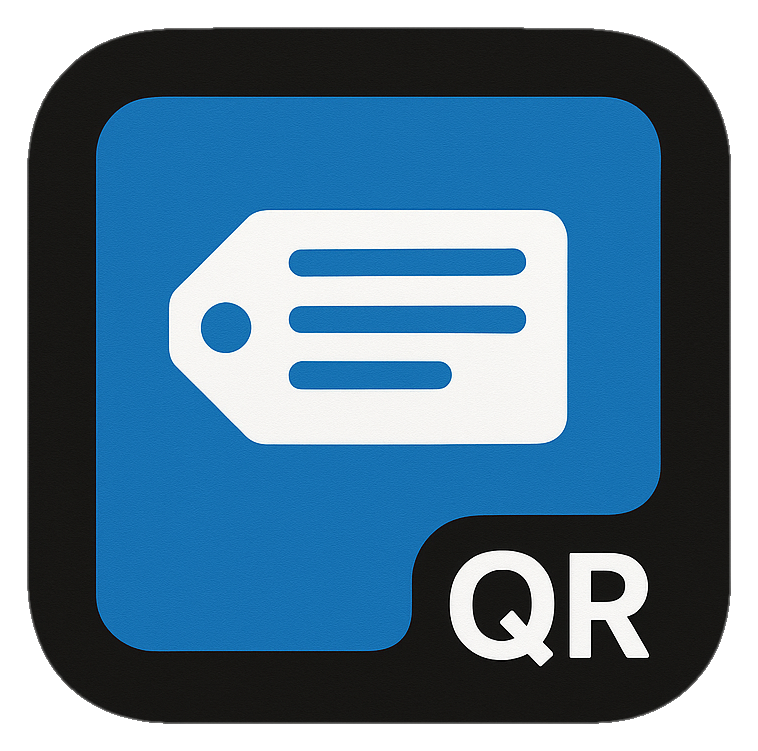
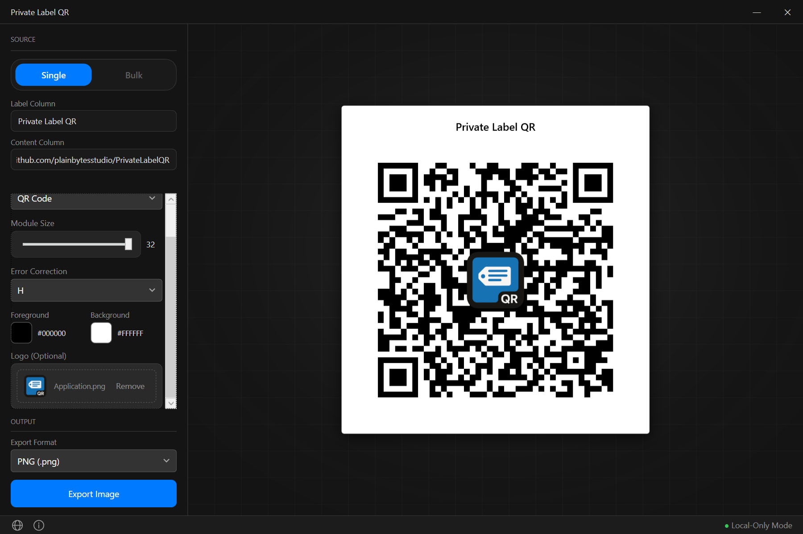
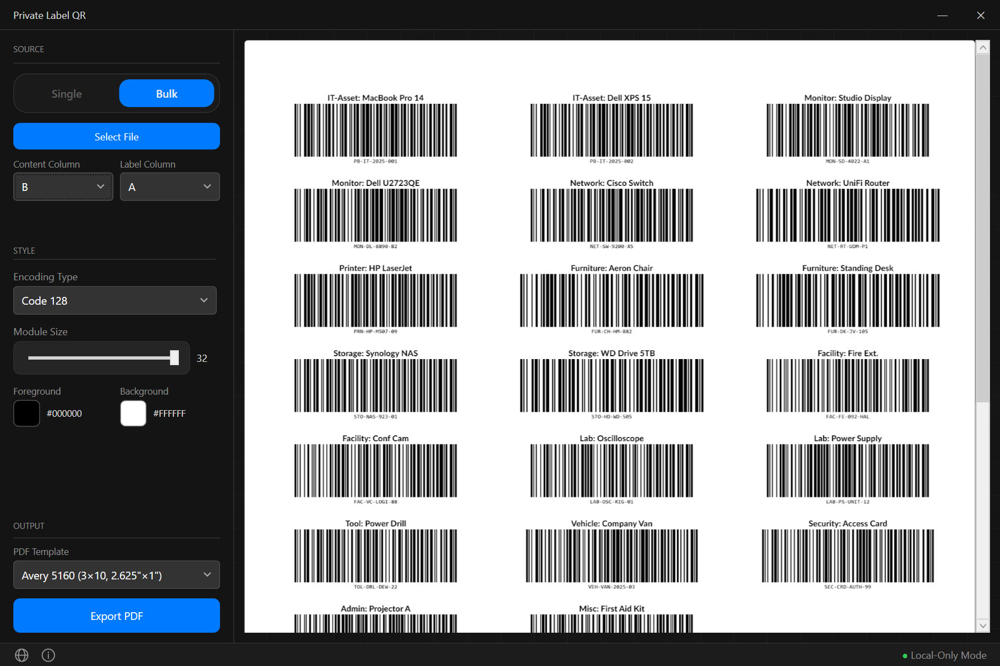

  

<h1 align="center">Private Label QR</h1>

  A privacy-first, native QR code &amp; barcode generator and label printer for Windows. 
  Built for speed, simplicity, and professional output.

  
  
  

---

## 🔒 Privacy Commitment

> **Your data never leaves your machine.**

Private Label QR is designed with a **zero-trust architecture**:

- **No internet connection required** — works fully offline, no handshake, no DNS lookup
- **No telemetry, analytics, or tracking** of any kind
- **No cloud storage** — files are read and written only to paths you choose
- **No background services** — the app does nothing when you're not using it

Your QR content, imported spreadsheets, and exported files stay on your local machine. Always.

> *This is a free tool provided by PlainBytes Studio. We keep it closed-source to prevent low-quality clones, but we guarantee 100% privacy and local processing.*

---

## 🛡️ Security Verified

As an independent developer project, this application is **not digitally signed** with an EV certificate. However, the release binary has been scanned and verified clean by all major antivirus engines worldwide.

  <strong>VirusTotal Result: 0 / 65 — Clean</strong> 
  Verified by Microsoft Defender, Kaspersky, BitDefender, Norton, ESET, Malwarebytes, Avast, and 65+ other engines.

   
  Click the image to view the full VirusTotal report

---

## 📸 Screenshots

   
  Single Mode — Real-time QR / Barcode preview with color customization

   
  Bulk Mode — Import CSV/Excel, map columns, preview &amp; export label PDF

---

## ✨ Features

### 🏷️ Single Mode
- Generate QR codes in real time as you type
- Export as **PNG**, **JPG**, **SVG** (vector), or **EPS** (vector)

### 📊 Bulk Mode
- Import data from **CSV** or **Excel** files (drag-and-drop or click to browse)
- Map any column to QR/Barcode content and label text
- Live first-page PDF preview with loading indicator
- Export professional label sheets using industry-standard templates:

| Template | Paper | Grid | Label Size |
|----------|-------|------|------------|
| Avery 5160 | US Letter | 3 × 10 | 2.625″ × 1″ |
| Avery 5163 | US Letter | 2 × 5 | 4″ × 2″ |
| Avery L7160 | A4 | 3 × 7 | 63.5 × 38.1 mm |
| Thermal 2″×1″ | 2″ × 1″ | 1 × 1 | Single label (thermal printers) |

### 📐 Barcode Support
- **Code 128** — general-purpose barcode, recommended for asset tags and inventory
- **EAN-13** — retail product barcode with automatic check-digit calculation
- High-DPI rendering with Human Readable Text (HRT)
- Smart encoding selector: choose QR Code, Code 128, or EAN-13 from a single dropdown

### 🎨 Style Customization
- **Color Picker** — HSV color wheel with hex input, preset swatches, and optional alpha channel
- Adjust module size (auto-optimized when logo is present) and error correction level (L / M / Q / H)
- Overlay a custom logo at the center of QR codes
- **Radial Spotlight Preview** — design canvas with subtle grid lines and a radial gradient spotlight effect

### 🖥️ Interface
- Dark theme with custom title bar
- Responsive layout — fixed sidebar, scalable preview canvas
- Smooth debounced preview refresh
- Status bar with language switcher and real-time feedback

### 🌍 Internationalization
- 5 languages: English, 简体中文, Deutsch, Français, 日本語
- Language preference persisted across sessions

---

## 🚀 Quick Start

### Prerequisites

- Windows 10 / 11 (x64)
- [.NET 8 Desktop Runtime](https://dotnet.microsoft.com/en-us/download/dotnet/thank-you/runtime-desktop-8.0.25-windows-x64-installer?cid=getdotnetcore) — download the latest **x64** installer from Microsoft if not already installed

### Download & Run

1. Download the latest **`PrivateLabelQR-v1.0.2-win-x64.zip`** from the Releases page
2. Extract the ZIP to a local folder
3. Run **`PrivateLabelQR.exe`**

> **💡 Windows SmartScreen Notice**
>
> Since this app is from an independent developer and is not digitally signed, Windows SmartScreen may show a warning on first launch. This is expected behavior for unsigned software — it does not indicate a security risk.
>
> To proceed: click **"More info"** → then click **"Run anyway"**.

   
  Drag an Excel file onto the canvas to instantly generate label previews

---

## 📋 Usage

1. **Single mode** — Type or paste content into Label + Content fields, customize style, export as image
2. **Bulk mode** — Drop a CSV/Excel file onto the canvas (or click to browse), map columns, export as label PDF
3. **Encoding** — Switch between QR Code, Code 128, and EAN-13; irrelevant controls hide automatically
4. **Style** — Adjust colors via the color picker, tune module size, error correction, and optional logo
5. **Output** — Choose format (image or PDF template) and click Export

---

  Built with care for people who value privacy.

