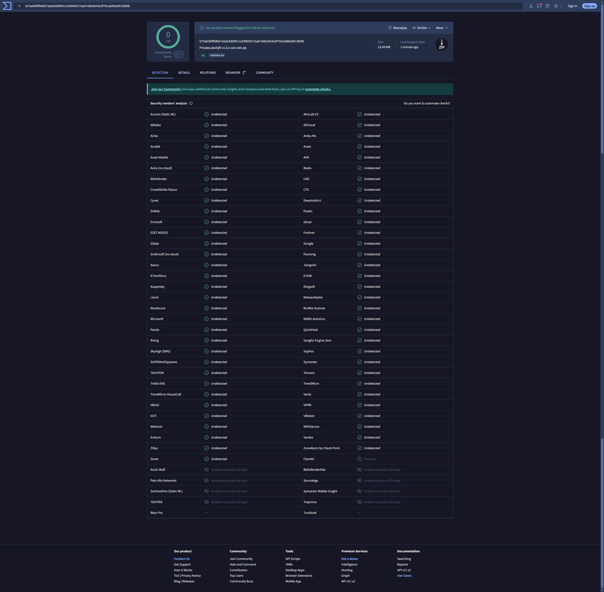

  

<h1 align="center">Generate 1000+ QR & Barcode Labels from Excel in Seconds</h1>

  <strong>Generate QR & Barcode labels from Excel in seconds — 100% offline.</strong> 
  No internet. No account. No subscription. Just drag, drop, and print.

  
  
  

---

**Your data doesn't belong on someone else's server.**
Private Label QR runs 100% on your machine. Import an Excel or CSV file, choose a label template, and export a print-ready PDF — all without an internet connection.

> **Workflow:** Import Excel → Generate QR / Barcode → Export PDF → Print

   
  Create a single QR code or barcode with live preview and custom colors

   
  Import hundreds of rows from Excel — export a print-ready label PDF in one click

---

## Who is this for?

| Use Case | What you do |
|----------|-------------|
| **Inventory & Warehouse** | Print shelf labels with QR codes from your stock list |
| **Asset Tracking** | Tag laptops, tools, and equipment with Code 128 barcodes |
| **Product Labeling** | Generate EAN-13 barcodes for retail from a product spreadsheet |
| **Small Business** | Create QR labels for menus, packaging, or tickets — no design skills needed |
| **IT & Operations** | Bulk-print asset tags from an Excel or CMDB export |

---

## What you can do

- **Generate QR codes & barcodes** — QR Code, Code 128, EAN-13 (auto check-digit)
- **Import Excel / CSV and batch-generate labels** — drag-drop, map columns, done
- **Export print-ready PDF** — Avery 5160, 5163, L7160, or 2"×1" thermal labels
- **Export single labels** — PNG, JPG, SVG, or EPS
- **Customize colors & branding** — foreground, background, logo overlay
- **5 languages** — English, Chinese, German, French, Japanese
- **100% offline** — no upload, no tracking, no network activity

---

## Why Private Label QR?

| | Online QR tools | Expensive label software | **Private Label QR** |
|---|---|---|---|
| Privacy | Data uploaded to servers | Varies | **Fully offline — data stays on your machine** |
| Bulk from Excel | Limited or paid | Complex setup | **Drag-drop, one-click export** |
| Cost | Free with watermarks | $50–$300/year | **Free** |
| Code types | QR only | Multiple | **QR, Code 128, EAN-13** |
| Setup | Browser-based | 30+ min install | **Unzip and run** |
| Internet | Required | Sometimes | **Never** |

---

## Free vs Pro

> **🚀 Limited Time Offer:** To celebrate our launch, **v1.0.2 is fully unlocked for free!** No watermarks, no limits. Enjoy professional tools for $0.

| | **v1.0.2 (Limited Free)** | **Pro — $19.99 (One-time)** |
|---|---|---|
| Batch export | **Unlimited** | **Unlimited** |
| PDF output | **No watermark** | **No watermark** |
| Logo on QR | **Supported** | **Supported** |
| Single label export | All formats | All formats |
| Label templates | All templates | All templates |
| Offline & private | Yes | Yes |

> Current version is fully functional. We only ask for your feedback or a ⭐ on GitHub!
>
> Need a permanent Pro license? [Visit Official Website](https://plainbytesstudio.github.io/PrivateLabelQR)

---

## Download

### [Download v1.0.2 Free — All Pro Features Included](https://github.com/plainbytesstudio/PrivateLabelQR/releases/latest)

1. Download **PrivateLabelQR-v1.0.2-win-x64.zip**
2. Extract to a local folder
3. Run **PrivateLabelQR.exe**

**Requires:** Windows 10/11 (x64) + [.NET 8 Desktop Runtime](https://dotnet.microsoft.com/en-us/download/dotnet/thank-you/runtime-desktop-8.0.25-windows-x64-installer?cid=getdotnetcore)

> **SmartScreen notice:** Windows may warn on first launch (unsigned app). Click **"More info"** → **"Run anyway"**.

---

## Safe & Private

- **VirusTotal: 0 / 65 — Clean** — verified by Microsoft Defender, Kaspersky, BitDefender, Norton, ESET, and 60+ engines

   
  Click to view the full VirusTotal report

- No internet connection (no tracking, no telemetry)
- All files processed and saved locally
- No background services — silent when closed

---

## Label Templates

| Template | Paper | Grid | Label Size |
|----------|-------|------|------------|
| Avery 5160 | US Letter | 3 × 10 | 2.625" × 1" |
| Avery 5163 | US Letter | 2 × 5 | 4" × 2" |
| Avery L7160 | A4 | 3 × 7 | 63.5 × 38.1 mm |
| Thermal 2"×1" | 2" × 1" | 1 × 1 | Single label |

---

  <a href="https://plainbytesstudio.github.io/PrivateLabelQR"><strong>Official Website</strong></a> &nbsp;·&nbsp;
  <a href="mailto:plainbytes.studio@gmail.com"><strong>Contact</strong></a>

